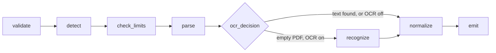

# n8n Document Converter

<p align="center">
  <a href="https://www.npmjs.com/package/@mazix/n8n-nodes-converter-documents"></a>
  <a href="https://www.npmjs.com/package/@mazix/n8n-nodes-converter-documents"></a>
  <a href="https://github.com/mazixs/n8n-node-converter-documents/actions/workflows/ci.yml"></a>
  
  <a href="LICENSE"></a>
</p>

Turn binary documents into text your workflow can actually use. The node reads the common document, spreadsheet, presentation and data formats, hands back plain text, HTML or Markdown for documents and named sheets of row objects for spreadsheets, and can fall back to local OCR when a PDF turns out to be a scan.

It appears in the n8n panel as **Convert Document** (node type `convertFileToJson`). Everything runs inside your own n8n — no external service, no API key, no upload.

- **Markdown output for LLMs.** DOCX converts to GFM Markdown with tables intact, which is what a RAG pipeline usually wants instead of flattened text.
- **Bounded by design.** Input size, concurrency, row counts, output characters and ZIP-container limits are all adjustable, with conservative defaults.
- **Machine-readable failures.** Every error carries a stable `code` and the pipeline `stage` it failed at, so a workflow can branch on it instead of matching message text.
- **Untrusted input in mind.** Office containers are inspected without extraction for traversal paths, entry counts, expanded size and compression ratios.

**Contents** · [Install](#install) · [Quick start](#quick-start) · [Formats](#supported-formats) · [Output](#output-shape) · [Error codes](#error-codes) · [Options](#options-and-limits) · [OCR](#ocr-for-scanned-pdfs) · [Migration](#migrating-from-node-version-5) · [Security](#security) · [Troubleshooting](#troubleshooting) · [Development](#development)

## Install

Requires Node.js 22.22.0 or newer and a self-hosted n8n that permits community nodes. CI covers Node.js 22.22.0 and 24.

Install `@mazix/n8n-nodes-converter-documents` under **Settings → Community Nodes**, or from the command line:

```bash
cd ~/.n8n
npm install @mazix/n8n-nodes-converter-documents
```

Restart n8n after a command-line installation.

OCR libraries ship as optional dependencies and are installed once with the package; choosing OCR in a workflow only activates them. To skip them and keep the installation smaller:

```bash
npm install --omit=optional @mazix/n8n-nodes-converter-documents
```

## Quick start

Put the node after anything that produces a binary file — HTTP Request, Read/Write Files from Disk, Google Drive, an email trigger — and point **Binary Property** at that property (`data` by default).

```
Google Drive (download)  →  Convert Document  →  AI Agent
```

One input file becomes one output item, so the rest of the workflow reads it directly:

```js
{{ $json.document.text }}                   // extracted content
{{ $json.document.metadata.fileType }}      // format actually detected
{{ $json.document.data }}                   // parsed object for JSON/XML/YML
{{ $json.document.sheets.Sheet1[0].A }}     // XLSX cell, keys are column letters
{{ $json.document.sheets.Sheet1[0].email }} // CSV row, keys come from the header
```

For a document set feeding an LLM, switch **Output Format** to `Markdown`; tables survive the conversion. For scanned PDFs, set **OCR Mode** to `When No Text Found` so recognition runs only when normal extraction comes back empty.

## Supported formats

| Group | Formats | What you get |
| --- | --- | --- |
| Documents | DOCX, PDF, TXT, MD, Markdown | `document.text`; DOCX additionally offers HTML and Markdown |
| Spreadsheets | XLSX, CSV | `document.sheets` — named sheets of row objects; XLSX keys are column letters, CSV keys come from the header row |
| OpenDocument | ODT, ODS, ODP | `document.text` — ODS included, it is extracted as text rather than rows |
| Presentations | PPTX | `document.text` |
| Data | JSON, XML, YML | `document.text` plus `document.data` with the parsed value |
| Web | HTML, HTM | `document.text` — body text, whitespace normalized |

Yandex Market YML catalogs are recognized and normalized into shop info, currencies, categories, offers and counters rather than dumped as raw XML.

Legacy binary DOC and PPT are detected by signature and rejected with migration guidance instead of being half-parsed — save them as DOCX or PPTX first.

## Output shape

Node version 6 emits one item per input file, preserves input order and `pairedItem`, and merges into the original `item.json` under `document`:

```json
{
  "requestId": "a-17",
  "document": {
    "status": "success",
    "text": "Extracted text",
    "warnings": ["File extension txt does not match detected type pdf"],
    "metadata": {
      "fileName": "report.txt",
      "fileSize": 208194,
      "fileType": "pdf",
      "declaredFileType": "txt",
      "detectedMime": "application/pdf",
      "processedAt": "2026-08-13T09:30:00.000Z",
      "processingTimeMs": 412.87
    }
  }
}
```

`document.data` appears for JSON, XML and YML input with the parsed value, so a downstream node reads `$json.document.data.someField` instead of parsing the string again. The key is absent for formats that produce no structured value, and `document.text` keeps its content in every case. **Max Output Characters** applies to `document.data` too.

The source binary is dropped unless **Keep Source Binary** is on.

### How a file travels through the node



The example above is exactly that mismatch: a file named `report.txt` that is really a PDF. Signature detection wins over the extension, the node parses it as a PDF, and the discrepancy lands in `warnings` instead of failing the item.

Whichever stage fails is reported in the error payload, which is what makes a failure diagnosable without digging through n8n logs.

## Error codes

With **Continue On Fail** enabled, a failed input stays in the ordered output instead of aborting the run:

```json
{
  "document": {
    "status": "error",
    "error": {
      "stage": "check_limits",
      "code": "ARCHIVE_LIMIT_EXCEEDED",
      "message": "ZIP container exceeds the 10000 entry limit",
      "fileName": "suspicious.docx"
    }
  }
}
```

Without it, n8n receives a `NodeOperationError` carrying the same information plus the item index.

These codes are a stable contract — branch on them with a Switch or IF node:

| Code | `stage` | Means |
| --- | --- | --- |
| `INVALID_INPUT` | `validate` | Item is not an object, the binary property is missing, or the file name is unusable |
| `EMPTY_CONTENT` | `validate`, `normalize` | The file is empty, or no text could be extracted from it |
| `UNSUPPORTED_FORMAT` | `detect` | Neither the extension nor the signature maps to a supported format |
| `FILE_TOO_LARGE` | `check_limits` | Input exceeds **Max File Size** |
| `ARCHIVE_LIMIT_EXCEEDED` | `check_limits` | Office container exceeds the entry, expanded-size or compression-ratio limit |
| `ARCHIVE_UNSAFE_PATH` | `check_limits` | Container holds an absolute or traversing entry path |
| `ARCHIVE_INVALID` | `check_limits` | Container cannot be read as a ZIP archive |
| `OCR_UNAVAILABLE` | `ocr_decision` | Optional OCR dependencies are not installed |
| `OCR_INVALID_OPTIONS` | `ocr_decision` | Language codes, scale, page count, timeout or a path failed validation |
| `OCR_TIMEOUT` | `ocr_decision` | A page exceeded **Page Timeout** |
| `OCR_FAILED` | `ocr_decision` | Recognition failed for another reason |
| `OUTPUT_LIMIT_EXCEEDED` | `normalize` | Structured output exceeds **Max Output Characters** |
| `PROCESSING_FAILED` | any | Parsing failed — corrupted, password-protected or non-standard file |

## Options and limits

Version 6 keeps limits under **Advanced Options**. Where noted, `0` disables the workflow-level limit and hands resource control to the n8n administrator.

| Option | Default | Purpose |
| --- | --- | --- |
| Max File Size (MB) | 50 | Input size ceiling; `0` for none |
| Max Concurrency | 4 | Input files processed in parallel |
| Max Rows per Sheet | 100000 | CSV and XLSX row cap; `0` for unlimited |
| Max TXT Characters | 1000000 | Plain-text character cap; `0` for unlimited |
| Max Output Characters | 1000000 | Text is truncated with a warning, structured output fails with `OUTPUT_LIMIT_EXCEEDED`; `0` for unlimited |
| Max Archive Entries | 10000 | Entries allowed in an Office container; `0` for unlimited |
| Max Archive Uncompressed Size (MB) | 200 | Expanded container size; `0` for unlimited |
| Max Compression Ratio | 100 | Expanded-to-compressed ratio, per entry and per archive; `0` for unlimited |

Two more choices sit outside that collection. **Output Format** applies to DOCX and selects plain text, HTML or Markdown. **JSON Output Mode** defaults to `Preserve Structure`; `Flatten` rewrites nested keys as dotted paths.

## OCR for scanned PDFs

OCR is local, PDF-only and off by default. Pick **When No Text Found** to run it only after normal extraction returns nothing, or **Always** to force it. The engine is `tesseract.js`, and pages are rendered locally through a PDF.js-compatible renderer.

| Option | Default | Notes |
| --- | --- | --- |
| Languages | `eng` | Tesseract codes joined by `+`, e.g. `rus+eng` |
| Language Data Path | — | Absolute local directory, or an HTTPS URL |
| Cache Path | — | Absolute writable directory for downloaded models |
| Render Scale | 2 | Higher means better recognition and more RAM |
| Max Pages | 10 | `0` processes every page |
| Page Timeout (seconds) | 60 | Raise cautiously |
| OCR Concurrency | 1 | Keep at 1 unless the host has ample CPU and RAM |

Recognized text arrives in `document.text` with per-page separators, and `document.metadata.ocr` reports the engine, languages, pages processed, average confidence and elapsed time.

The first run may download a language model. Set an absolute **Cache Path** for predictable persistence, or place language data on disk and point **Language Data Path** at it for an offline host. HTTPS locations work, but use only ones an administrator controls. One worker is reused per PDF and terminated on success, failure or timeout.

OCR is CPU- and RAM-hungry, especially on high-resolution multi-page scans. It suits a self-hosted instance, not a constrained shared one. PaddleOCR is not bundled: its official JavaScript package is browser-oriented while the main runtime needs Python and PaddlePaddle. The internal engine interface leaves room for a future Node.js-compatible adapter.

## Migrating from node version 5

Existing workflows stay on version 5 and keep its single aggregate output, `{ files, totalFiles, processedAt }`. Version 5 exposes only file size and concurrency; its row, output and archive limits are hard-coded, it has no OCR, and one bad file fails the whole node because per-item error handling arrived with version 6.

To move a workflow: add a fresh node or switch the version, then rewrite expressions from `$json.files[0].text` to `$json.document.text`. Because one file now yields one item, check any downstream batching that assumed a single aggregate item, and enable **Keep Source Binary** only if a later node needs the original file.

## Security

Parsing untrusted documents is resource-sensitive by nature.

Keep the size and archive limits on — they exist to stop compression bombs and pathological containers. Restrict community-node installation and OCR model configuration to trusted administrators, since **Language Data Path** accepts remote locations. Avoid retaining source binaries unless a downstream node genuinely needs them.

PDF.js is pinned to an exact version that sits outside the affected range of [GHSA-hq66-cqwq-w95j](https://github.com/advisories/GHSA-hq66-cqwq-w95j), and a dependency test fails the build if any copy in the tree drifts into it. `npm audit --omit=dev --audit-level=high` runs in CI and before every publish.

Report vulnerabilities privately through the repository's GitHub security advisory feature.

## Troubleshooting

| Symptom | What to do |
| --- | --- |
| `OCR_UNAVAILABLE` | Reinstall without `--omit=optional`, then restart n8n |
| `OCR_TIMEOUT` | Lower **Render Scale** or **Max Pages**, or raise **Page Timeout** |
| Missing language model | Check the language code and the model directory or HTTPS location |
| Empty PDF text | Set **OCR Mode** to `When No Text Found` — the PDF is probably a scan |
| `ARCHIVE_LIMIT_EXCEEDED` | Inspect the document before raising ZIP limits; this is what a bomb looks like |
| `OUTPUT_LIMIT_EXCEEDED` | Raise **Max Output Characters** or split the input into smaller batches |
| Legacy DOC or PPT rejected | Re-save as DOCX or PPTX; the binary formats are not parsed |
| Wrong format detected | The signature won over the extension — check `metadata.detectedMime` and `warnings` |

## Development

```bash
npm ci                  # reproducible dependency install
npm run lint            # ESLint 10
npm run typecheck       # TypeScript without emit
npm run test            # Jest
npm run test:coverage   # coverage gates, global and per file
npm run build           # clean dist/ and compile
npm run verify:package  # inspect the npm archive contents
npm run test:ci         # everything CI runs — do this before a PR
```

`npm run test:ocr-smoke` runs real OCR and may download the English model; regular CI uses deterministic mocks. Architecture notes and the non-obvious traps live in [CLAUDE.md](CLAUDE.md), contribution rules in [AGENTS.md](AGENTS.md), release mechanics in [.github/workflows/README.md](.github/workflows/README.md), and the version history in [CHANGELOG.md](CHANGELOG.md).

## License

[MIT](LICENSE) © mazix
